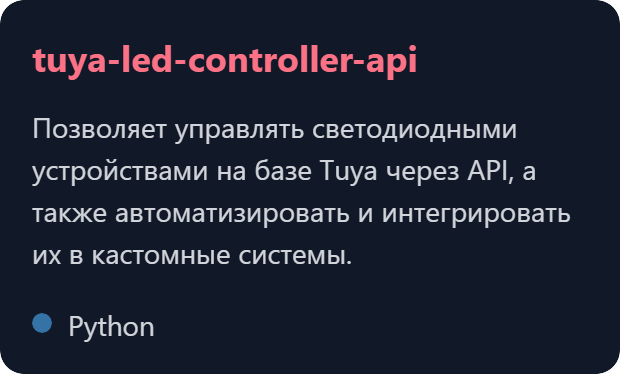
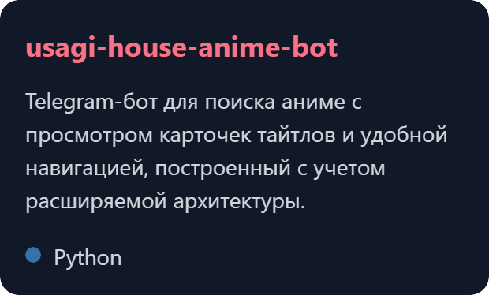
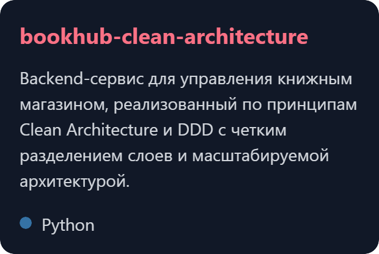
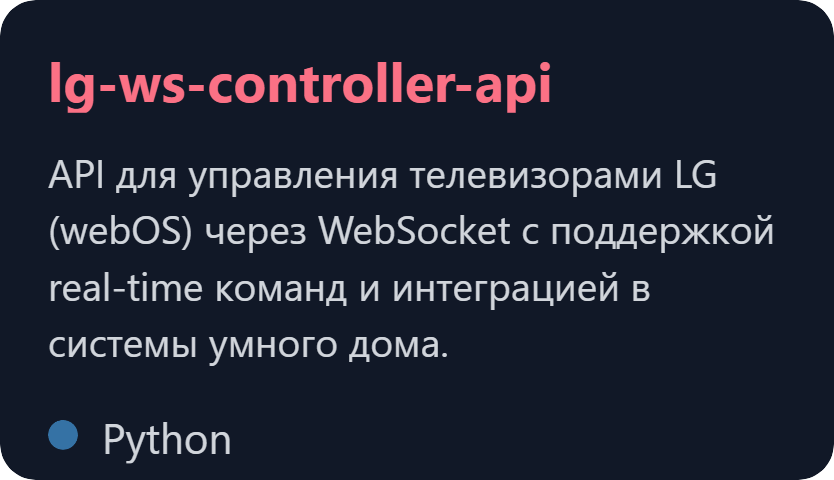

<h1 align="center">Владислав Батманов</h1>

  

  Разрабатываю backend-системы, API и сервисы автоматизации на Python

  
  &#8287;&#8287;&#8287;&#8287;&#8287;
  
  &#8287;&#8287;&#8287;&#8287;&#8287;
  

 
  
<h2>📘 Мои Open Source Проекты</h2>

    

      
      
      
      
    

    

 
  
<h2>🛠️ Стек </h2>

  <h3>👨‍💻 Языки программирования</h3>
  

    
    
    
  

  <h3>🧰 Фреймворки и инструменты</h3>
  

    
    
    
    
    
    
    
  

  <h3>️️🗄️ Базы данных</h3>
  

    
    
    
    
  

  <h3>️️💻 Инструменты</h3>
  

    
    
    
    
    
    
    
    
    
    
  

  <h3>️️Мониторинг</h3>
  

    
    
    
  

  <h3>️️Документация</h3>
  

    
  

---

## 📊 Статистика

  

  

